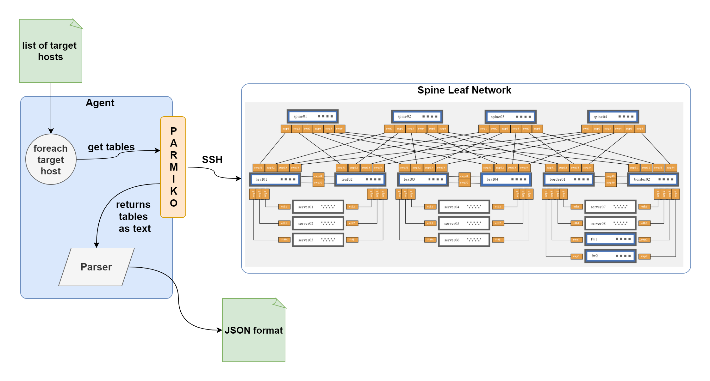

# ship_discovery_agent
Discovery agent  for SONiC spine leaf network

## project overview
[ANTD](https://www.nist.gov/itl/antd) is building the next network management system, [the multiverse network management system](https://github.com/multiverse-nms) which will support multiple networking paradymes, essentially IP and NDN networks.
The main conponent is the multiverse controller that defines the models and standards to describe and managed the network. The controller exposes APIs for Agents to communicate with it.
the Agents role is to report about the state of the network or run commands issued by the controller to change a network configuration.


## project details
The goal of this project is to build an agent that can run commands remotely on SONiC network devices through the SSH protocol, Retrieve multiple tables describing the state of the network (ARP table, Routing table, CAM table, Acess lists ...etc.), and parse the collected tables into a `JSON` format.



### Setting up the environment

1. create an account with [https://air.nvidia.com/](https://air.nvidia.com/)
2. click on `Build Simulation` and choose `SONiC demo`
3. wait for the nodes to become available

Once the SONiC demo network is created, it comes with a default configuration.

However, we want to load our own configuration. To achieve that follow these steps

```
	git clone https://gitlab.com/hani.merzouki/sonic-demo
	cd sonic-demo/automation
	ansible-playbook -i inventory/pod1/hosts playbooks/restore_sonic.yml
	ansible-playbook -i inventory/pod1/hosts playbooks/restore_files.yml
```
running the ansible-playbooks takes a while, so be patient.

### running the agent

1. clone the repo
```
	git clone https://github.com/MheniMerz/ship_discovery_agent & cd ship_discovery_agent/
```
2. run the `init.sh` script in the current shell by sourcing it
```
	source init.sh
```
3. install the required packages
```
	pip3 install -r requirements.txt
```
4. run `main.py`
```
	python3 main.py
```

### testing
